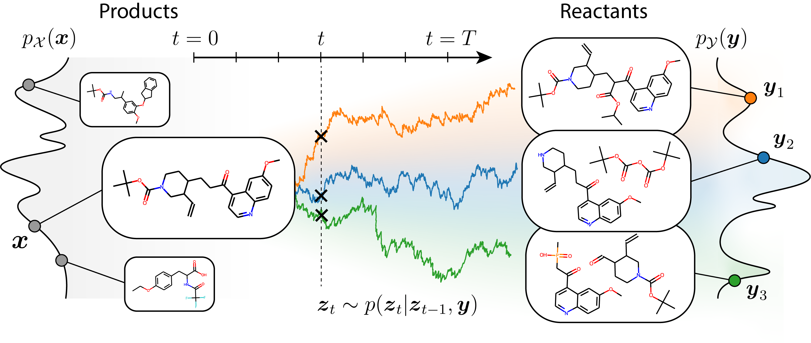

# RetroBridge: Modeling Retrosynthesis with Markov Bridges

<a href="https://openreview.net/forum?id=770DetV8He"></a>

Official implementation of RetroBridge, a [**Markov bridge model for retrosynthesis planning**](https://arxiv.org/abs/2308.16212) by Ilia Igashov*, Arne Schneuing*, Marwin Segler, Michael Bronstein and Bruno Correia.

>We model single-step retrosynthesis planning as a distribution learning problem in a discrete state space. First, we introduce the Markov Bridge Model, a generative framework aimed to approximate the dependency between two intractable discrete distributions accessible via a finite sample of coupled data points. Our framework is based on the concept of a Markov bridge, a Markov process pinned at its endpoints. Unlike diffusion-based methods, our Markov Bridge Model does not need a tractable noise distribution as a sampling proxy and directly operates on the input product molecules as samples from the intractable prior distribution. We then address the retrosynthesis planning problem with our novel framework and introduce RetroBridge, a template-free retrosynthesis modeling approach that achieves state-of-the-art results on standard evaluation benchmarks.



## Environment Setup

|Software|Version|
|-----|-----|
|Python|3.9|
|CUDA|11.6|

```shell
conda create --name retrobridge python=3.9 rdkit=2023.09.5 -c conda-forge -y
conda activate retrobridge
pip install -r requirements.txt
```

## Example

To sample reactants for a given product molecule:
```
mkdir -p models
wget https://zenodo.org/record/10688201/files/retrobridge.ckpt?download=1 -O models/retrobridge.ckpt
python predict.py --smiles "CN1C=NC2=C1C(=O)N(C(=O)N2C)C" --checkpoint models/retrobridge.ckpt
```

## Training

* RetroBridge: `python train.py --config configs/retrobridge.yaml --model RetroBridge`
* DiGress: `python train.py --config configs/digress.yaml --model DiGress`
* ForwardBridge: `python mit/train.py --config configs/forwardbridge.yaml`

## Sampling

Trained models can be downloaded from [Zenodo](https://zenodo.org/record/10688201):
```shell
mkdir -p models
wget https://zenodo.org/record/10688201/files/retrobridge.ckpt?download=1 -O models/retrobridge.ckpt
wget https://zenodo.org/record/10688201/files/digress.ckpt?download=1 -O models/digress.ckpt
wget https://zenodo.org/record/10688201/files/forwardbridge.ckpt?download=1 -O models/forwardbridge.ckpt
```

Sampling with RetroBridge model:
```shell
python sample.py \
       --config configs/retrobridge.yaml \
       --checkpoint models/retrobridge.ckpt \
       --samples samples \
       --model RetroBridge \
       --mode test \
       --n_samples 10 \
       --n_steps 500 \
       --sampling_seed 1
```

Sampling with DiGress:
```shell
python sample.py \
       --config configs/digress.yaml \
       --checkpoint models/digress.ckpt \
       --samples samples \
       --model DiGress \
       --mode test \
       --n_samples 10 \
       --n_steps 500 \
       --sampling_seed 1
```

Sampling with ForwardBridge:
```shell
python sample_MIT.py \
       --config configs/forwardbridge.yaml \
       --checkpoint models/forwardbridge.ckpt \
       --samples samples \
       --model RetroBridge \
       --mode test \
       --n_samples 10 \
       --n_steps 500 \
       --sampling_seed 1
```

## Evaluation

### Run Molecular Transformer for round-trip evaluation

Download Molecular Transformer and follow the instructions on their [GitHub page](https://github.com/pschwllr/MolecularTransformer)

To make forward predictions for all generated reactants, run:
```bash
python /src/metrics/round_trip.py --csv_file <path/to/retrobridge_csv> --csv_out <path/to/output_csv> --mol_trans_dir <path/to/MolecularTransformer_dir>
```

### Metrics

To compute the metrics reported in the paper, run the following commands in python:
```python
import numpy as np
import pandas as pd

from pathlib import Path
from src.metrics.eval_csv_helpers import canonicalize, compute_confidence, assign_groups, compute_accuracy

csv_file = Path('<path/to/output_csv>')
df = pd.read_csv(csv_file)
df = assign_groups(df, samples_per_product_per_file=10)
df.loc[(df['product'] == 'C') & (df['true'] == 'C'), 'true'] = 'Placeholder'

df_processed = compute_confidence(df)

for key in ['product', 'pred_product']:
    df_processed[key] = df_processed[key].apply(canonicalize)

compute_accuracy(df_processed, top=[1, 3, 5, 10], scoring=lambda df: np.log(df['confidence']))
```

## License

RetroBridge is released under [CC BY-NC 4.0](LICENSE.txt) license.

## Contact

If you have any questions, please contact ilia.igashov@epfl.ch or arne.schneuing@epfl.ch.
